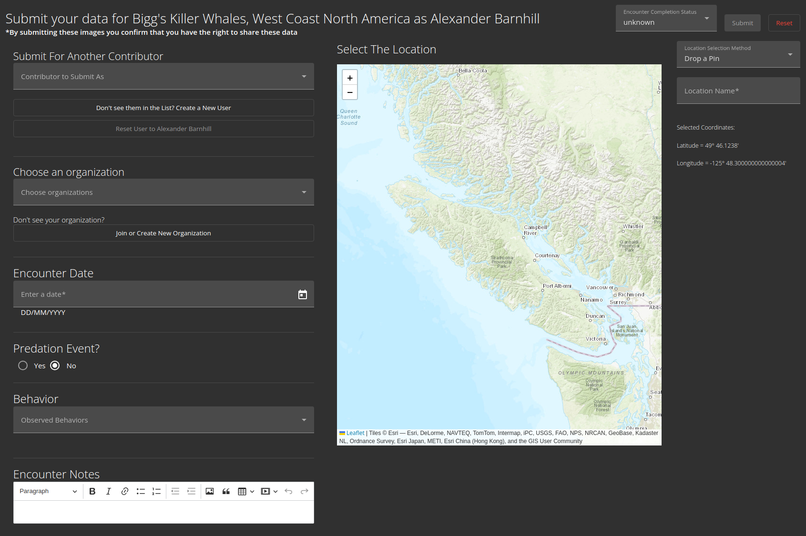
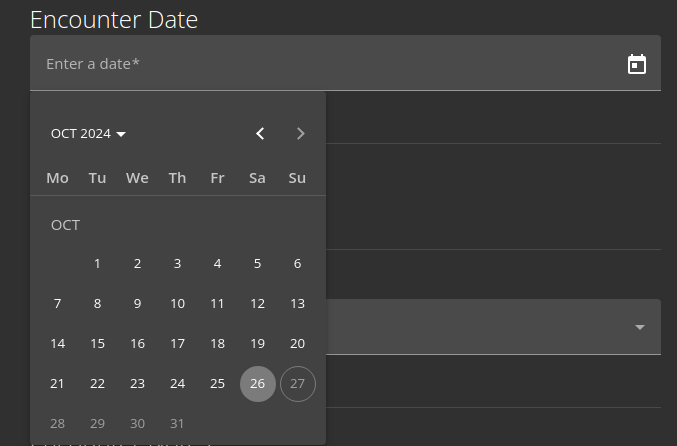

.. _submission:

Data Submission
===============

Submission Details
-----------------

There are three main components that are **required** for an encounter submission:

- :ref:`Date <date_selection>`
- :ref:`Location <location_selection>`
- Images

The following information is optional, but may help organize your submissions:

- Organization(s)
- Predation Information
- Behavior Information
- Notes

.. _date_selection:
Date Selection
~~~~~~~~~~~~~~
Users can select any date, as long as it is in the past.

.. _location_selection:
Location Selection
~~~~~~~~~~~~~~~~~~

.. image:: image/submission/location-selection.png
   :alt: Location Selection Map
   :align: center
   :width: 800px

Users have two ways to select a location. Either by clicking somewhere on the map where the encounter took place, in which the coordinates will automatically be extracted

.. image:: image/submission/location-selection-pin-drop.png
   :alt: Pin Drop Results
   :align: center
   :width: 400px

or by specifying the coordinates in Degrees Decimal Minutes (DDM) format.

.. image:: image/submission/location-selection-coordinates.png
   :alt: DDM Selection
   :align: center
   :width: 400px

Either way, the user must select a name for the location, which will be used later in the encounter details.

