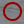

Encounters
==========

.. _encounters:

========================================
Encounters Overview - Finwave
========================================

The **Encounter Overview Page** (`https://finwave.io/encounters`) displays the most recent encounters for a population, providing essential information for researchers and administrators.

----------------------------------------
Encounter Information
----------------------------------------

Each encounter is presented with a thumbnail image that visually represents the encounter. This image is overlayed with the following information:

- **Date:** The date the encounter occurred.
- **Location:** The geographical location where the encounter took place.
- **Photographer:** Name of the photographer who captured the images.
- **Number of Images:** The total number of images in the encounter.
- **Number of Detected Fins:** The number of fins detected by Finwave’s machine learning models.
- **Confirmed Identities:** The confirmed identities of individuals in the encounter.

----------------------------------------
Encounter Status Icons
----------------------------------------

On the right side of the overlay, icons provide quick visual indicators for the encounter status:

1. **Analysis Status Icon:**

- |green_icon| : Analysis complete.

.. |yellow_icon| image:: img/encounters/overview/icons/yellow_circ.png
   :width: 24px
   :alt: Analysis in progress

- |yellow_icon| : Analysis in progress.

- |yellow_icon| : New Encounter

2. **Encounter Completion Icon:**

- |complete_icon| : All animals present were photographed (complete encounter).

- |incomplete_icon| : Incomplete encounter (not all animals present were photographed).

- |unknown_icon| : Unknown if all animals were photographed.

3. **Encounter Completion Icon:**

- |pred_event| : This encounter represents a predation event

4. **License Details Icon:**

- |cc| : Public domain or shared under a creative commons license.

- |non_com| : Non-commercial use only.

- |attribution| : Attribution of the photographer is required for use.

----------------------------------------
Search and Filter Options
----------------------------------------

The encounter overview page provides a powerful search and filter interface, allowing users to refine encounter results using the following options:

1. **Data Source:**

   - **All Public Data:** Display encounters accessible to the public.
   - **Data from My Organizations:** Show encounters from the user’s associated organizations.
   - **Both:** Combine public data and data from the user’s organizations.

2. **Encounter Completion Status:**

   - **Complete:** All animals present were photographed.
   - **Incomplete:** Some animals present were not photographed.
   - **Unknown:** Encounter completion status is unknown.

3. **Behavioral Annotations:**

   - Population-specific behaviors defined by population administrators.
   - Users can filter encounters based on observed behaviors.

4. **Analysis Status:**

   - **New:** Encounter is newly uploaded, and analysis has not started.
   - **In Progress:** Encounter analysis is ongoing.
   - **Finished:** Analysis is complete, and results are available.

5. **Individuals of Interest:**

   - Multi-select for selecting specific individuals.
   - Allows focusing on encounters where selected individuals were identified.

6. **Photographers:**

   - Multi-select for choosing one or more photographers.
   - Helps refine encounters based on the image contributors.

7. **Locations:**

   - Multi-select to filter by geographical locations.
   - Useful for narrowing down encounters to specific areas of interest.

8. **Date Range:**

   - Specify a date range to filter encounters that occurred within a particular timeframe.

----------------------------------------
Usage and Interaction
----------------------------------------

- **Thumbnail Click:** Clicking on a thumbnail opens a detailed encounter page with full metadata, individual identification results, and encounter analysis details.

----------------------------------------
Contact and Support
----------------------------------------

For assistance with using the encounter overview page or understanding the encounter status:

- **Email:** info@finwave.io
- **Documentation:** https://docs.finwave.io

Single Encounters
----------------

