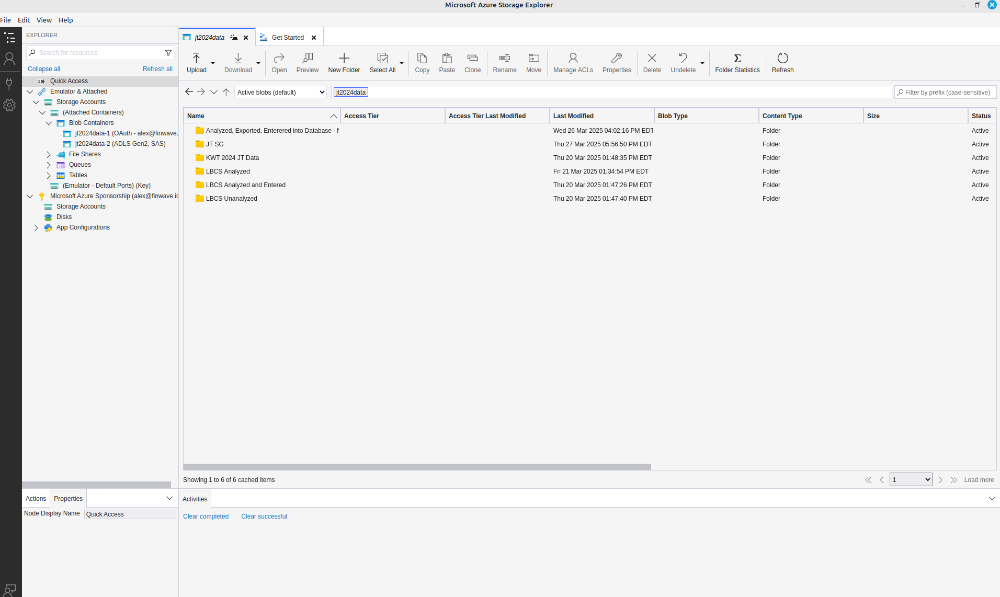
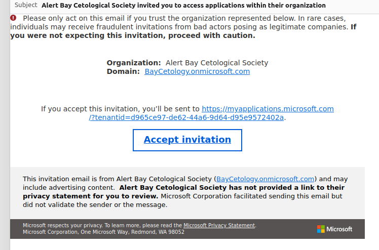
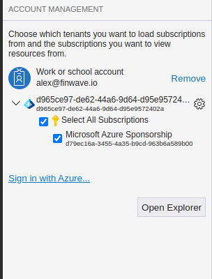
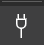

.. _onboarding:

=======================================
Finwave Data Onboarding Documentation
=======================================

Finwave supports data onboarding through two main processes:

1. **Model Training:** Training a deep learning model to identify individuals in the population.
2. **Encounter Onboarding:** Uploading photos and metadata of historical encounters to provide a record of individuals.

.. _model_training:

----------------------------------------
1. Model Training
----------------------------------------

**Process Overview:**

- Extract identifying characteristics of individuals (usually dorsal fins) from full encounter photos.
- Use these extracted fins to train a deep learning model.
- Deploy the trained model to our model zoo for identification of individuals in newly uploaded encounters.

**Requirements for Model Training:**

- **Photos of Individuals:**
   - Photos should feature individuals in the population under consideration.
   - Cropping is not necessary, but if multiple individuals are present in the photo, it is preferable to crop the photos for easier processing.
   - Images should be clear, high resolution, and capture identifying features.

.. _encounter_onboarding:

----------------------------------------
2. Encounter Onboarding
----------------------------------------

**Process Overview:**

- Photos should be arranged in a folder structure that is machine interpretable.
- Each encounter’s photos should be placed in a folder that identifies the encounter. The folder naming scheme should be consistent.
- Historical encounters must include the following metadata:
    - **Location:** Name, latitude, and longitude.
    - **Photographer:** First name, last name, and optionally an email address. If the email is unavailable, a dummy email can be created temporarily.
    - **Date:** Date of the encounter.
    - **Photos:** High-quality images associated with the encounter.

**Metadata Organization:**

- Metadata can be:
    - Incorporated in the folder name.
    - Provided in a separate mapping file that associates the folder name with the relevant data.

----------------------------------------
Getting Data to Us
----------------------------------------

We offer multiple ways to upload your data to Finwave:

1. **Azure Storage Browser:**
   - We provide credentials to upload data directly to Azure storage.
   - You can use the Azure Storage Browser tool to facilitate the upload.
   - More information found :ref:`here <storage_browser>`.
   - Once the data is uploaded, please let us know and we will process it, and reach out if we have questions.

2. **Cloud Storage Platforms:**
   - You can send data directly via platforms such as Google Drive or Microsoft OneDrive.
   - We can manually import data if provided in a structured format.

3. **Finwave Onboarding Tool:**
   - Our onboarding tool automates encounter data upload directly to Finwave.
   - Currently, this involves running a Python script via the command line.
   - A cross-platform GUI tool is in development to streamline this process.

.. _storage_browser:

Azure Storage Browser
----------------------------------------
Probably the easiest way of getting data to us is by using the tool that Azure already provides
for desktop access to cloud data.

The storage browser can be found `here <https://azure.microsoft.com/en-us/products/storage/storage-explorer>`_.

The process is as follows:

1. We will create an account for you to be able to access this storage.
2. You will receive an email from Microsoft inviting you to participate in our organization

3. After accepting the invitation, you can now sign in and :ref:`connect <storage_browser_authentication>`  to the storage browser. We will provide you with a
link which you can use in the storage browser to directly connect to our storage. You can then upload / download / delete things
as you wish.

.. _storage_browser_authentication:

Azure Storage Browser Authentication
-----------------------------------------

After being able to sign in after receiving the invitation, you are ready to connect.

1. Click on the Account button (represented by |sign_in|)
2. Click the "Sign In to Azure" link in the account management panel on the left side of the browser.
3. Select "Azure" from the Select Azure Environment screen and hit "next"
4. You will be redirected to the Azure sign in page in your browser
5. If you do not see the account listed which is associated with your invitation, click "Use another account" and enter in your email
6. Click "Sign In Options"
7. Click "Sign in to an organization"
8. Enter the domain name baycetology.onmicrosoft.com
9. Enter your credentials and authenticate
10. Return to the storage browser and you should see something similar to this

Azure Storage Browser Authentication Issues
-----------------------------------------
Sometimes it can be the case that Microsoft struggles with accounts that are already associated
with a Microsoft account.

In this case, you will want to try:

1. Log out of microsoft completely
2. Remove the account from the storage browser
3. Start again with the :ref:`browser connection <storage_browser_authentication>`

Azure Storage Browser Connection
----------------------------------------
Once you are authenticated in the storage browser, you are ready to connect to the storage container.

1. Click on the |connect| connect icon
2. Click "Blob Container or Directory"
3. Select "Shared access signature URL (SAS)
4. In the box for "Blob container or directory SAS URL:" enter in the link that **we will provide to you**

Keep in mind this link is only valid for a certain amount of time. We will tell you how long it is good for, and provide
another if we need to.

Once connected, you should see something like this:

.. image:: img/onboarding/storage_browser/storage_container.png
   :alt: Azure Storage Containers
   :align: center
   :width: 250px

While the names will be different, the main thing is the hierarchy of folders, for example

- Storage Accounts
    - (Attached Containers)
        - Blob Containers
            - **YOUR CONTAINER NAME** (ADLS Gen2, SAS)

Clicking on **YOUR CONTAINER NAME** will open up that container in the storage browser. Then you are free to
upload your data in any form you wish, keeping in mind our requirements for :ref:`model training <model_training>` and
:ref:`encounter onboarding <encounter_onboarding>`

----------------------------------------
Uploading Individual Photos
----------------------------------------

For individual photos, the preferred method is to:

- Upload them via the Azure Storage Browser or cloud platforms like Google Drive.
- Place individual photos in folders where the **folder name corresponds to the identity of the individual.**

Maintaining a consistent folder structure and metadata organization ensures seamless integration with Finwave and facilitates accurate identification and encounter management.

----------------------------------------
Contact and Support
----------------------------------------

For assistance with data onboarding or credentials for Azure storage:

- Email: info@finwave.io
- Documentation: https://docs.finwave.io