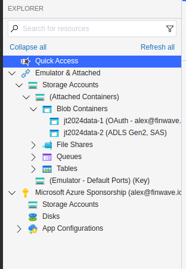

.. _onboarding:

=======================================
Finwave Data Onboarding Documentation
=======================================

Finwave supports data onboarding through two main processes:

1. **Model Training:** Training a deep learning model to identify individuals in the population.
2. **Encounter Onboarding:** Uploading photos and metadata of historical encounters to provide a record of individuals.

.. _model_training:

----------------------------------------
1. Model Training
----------------------------------------

**Process Overview:**

- Extract identifying characteristics of individuals (usually dorsal fins) from full encounter photos.
- Use these extracted fins to train a deep learning model.
- Deploy the trained model to our model zoo for identification of individuals in newly uploaded encounters.

**Requirements for Model Training:**

- **Photos of Individuals:**
   - Photos should feature individuals in the population under consideration.
   - Cropping is not necessary, but if multiple individuals are present in the photo, it is preferable to crop the photos for easier processing.
   - Images should be clear, high resolution, and capture identifying features.

.. _encounter_onboarding:

----------------------------------------
2. Encounter Onboarding
----------------------------------------

**Process Overview:**

- Photos should be arranged in a folder structure that is machine interpretable.
- Each encounter’s photos should be placed in a folder that identifies the encounter. The folder naming scheme should be consistent.
- Historical encounters must include the following metadata:
    - **Location:** Name, latitude, and longitude.
    - **Photographer:** First name, last name, and optionally an email address. If the email is unavailable, a dummy email can be created temporarily.
    - **Date:** Date of the encounter.
    - **Photos:** High-quality images associated with the encounter.

**Metadata Organization:**

- Metadata can be:
    - Incorporated in the folder name.
    - Provided in a separate mapping file that associates the folder name with the relevant data.

----------------------------------------
Getting Data to Us
----------------------------------------

We offer multiple ways to upload your data to Finwave:

1. **Azure Storage Browser:**
   - We provide credentials to upload data directly to Azure storage.
   - You can use the Azure Storage Browser tool to facilitate the upload.
   - More information found :ref:`here <storage_browser>`.
   - Once the data is uploaded, please let us know and we will process it, and reach out if we have questions.

2. **Cloud Storage Platforms:**
   - You can send data directly via platforms such as Google Drive or Microsoft OneDrive.
   - We can manually import data if provided in a structured format.

3. **Finwave Onboarding Tool:**
   - Our onboarding tool automates encounter data upload directly to Finwave.
   - Currently, this involves running a Python script via the command line.
   - A cross-platform GUI tool is in development to streamline this process.

.. _storage_browser:

Azure Storage Browser
----------------------------------------
Probably the easiest way of getting data to us is by using the tool that Azure already provides
for desktop access to cloud data.

The storage browser can be found `here <https://azure.microsoft.com/en-us/products/storage/storage-explorer>`_.

Azure Storage Browser Connection
----------------------------------------

1. Click on the |connect| connect icon
2. Click "Blob Container or Directory"
3. Select "Shared access signature URL (SAS)
4. In the box for "Blob container or directory SAS URL:" enter in the link that **we will provide to you**

Keep in mind this link is only valid for a certain amount of time. We will tell you how long it is good for, and provide
another if we need to.

Once connected, you should see something like this:

While the names will be different, the main thing is the hierarchy of folders, for example

- Storage Accounts
    - (Attached Containers)
        - Blob Containers
            - **YOUR CONTAINER NAME** (ADLS Gen2, SAS)

Clicking on **YOUR CONTAINER NAME** will open up that container in the storage browser. Then you are free to
upload your data in any form you wish, keeping in mind our requirements for :ref:`model training <model_training>` and
:ref:`encounter onboarding <encounter_onboarding>`

Azure Storage Browser Issues
----------------------------------------
- **Loading circle never goes away**: On **Windows** computers, the installation of the Storage Browser may also require the installation of **.NET**, which is a collection of system packages that the software needs. It may therefore be necessary to run the installation as an **Administrator** and **not** select the option *Install Only For Me*

----------------------------------------
Uploading Individual Photos
----------------------------------------

For individual photos, the preferred method is to:

- Upload them via the Azure Storage Browser or cloud platforms like Google Drive.
- Place individual photos in folders where the **folder name corresponds to the identity of the individual.**

Maintaining a consistent folder structure and metadata organization ensures seamless integration with Finwave and facilitates accurate identification and encounter management.

----------------------------------------
Contact and Support
----------------------------------------

For assistance with data onboarding or credentials for Azure storage:

- Email: info@finwave.io
- Documentation: https://docs.finwave.io