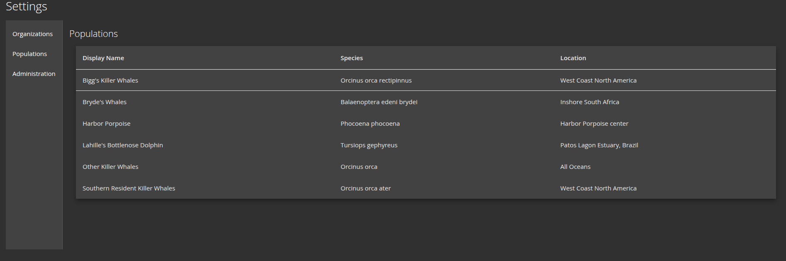
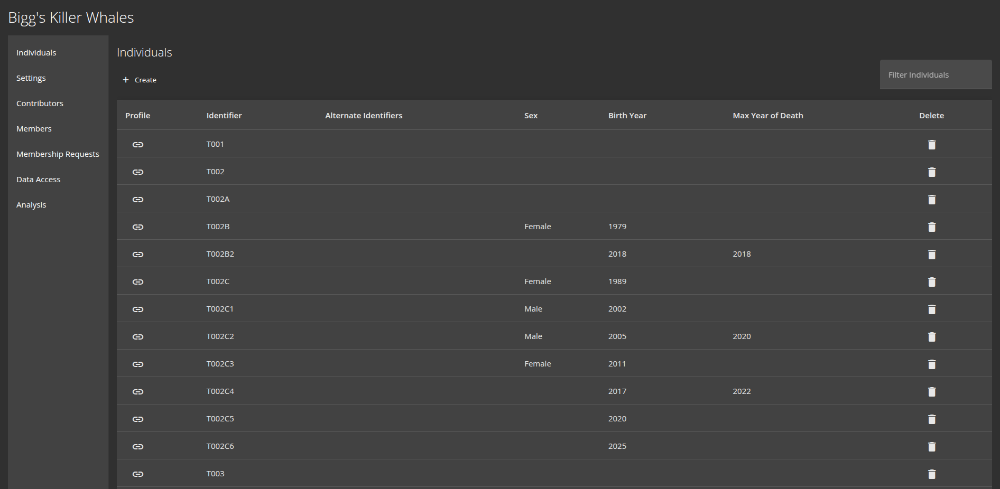
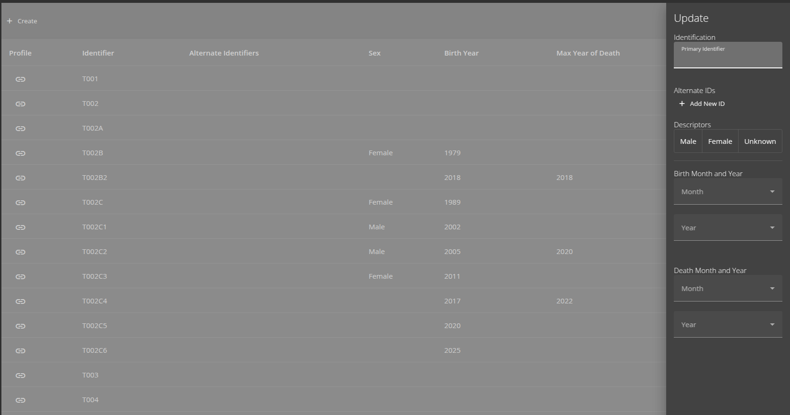
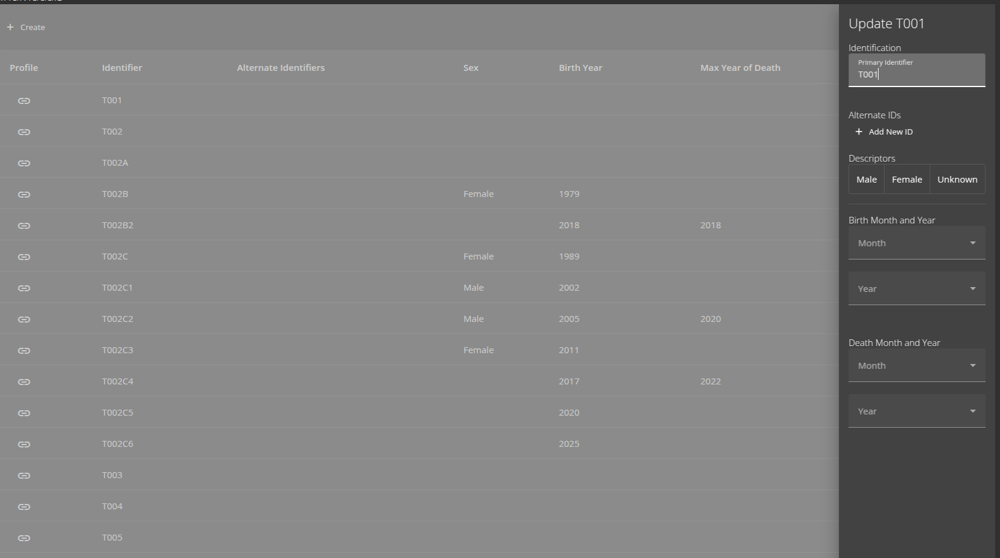
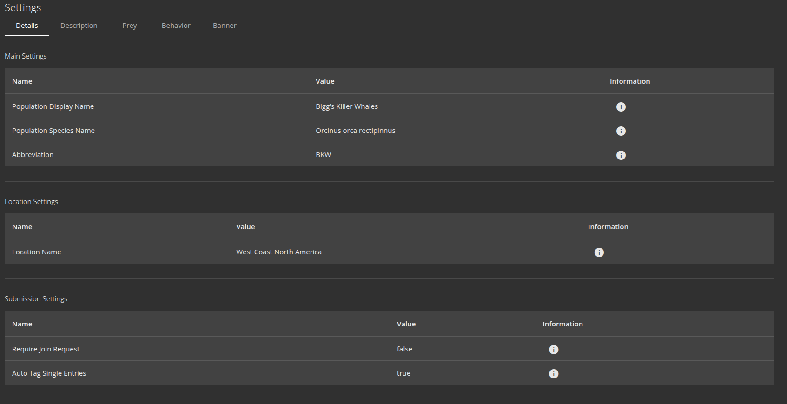
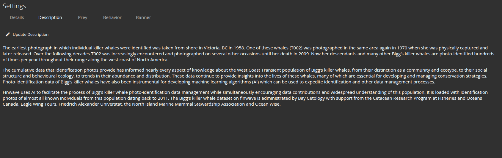
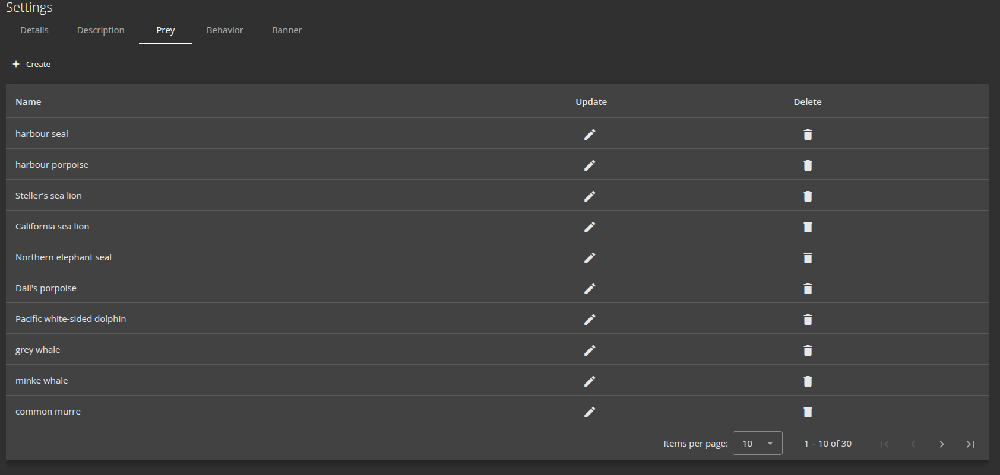
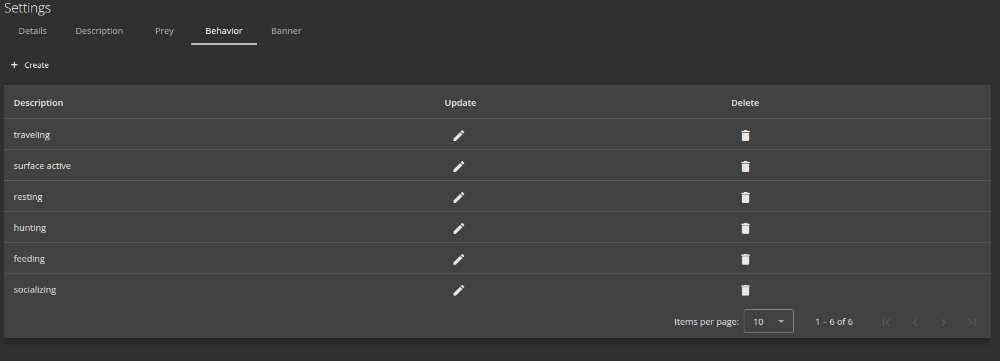
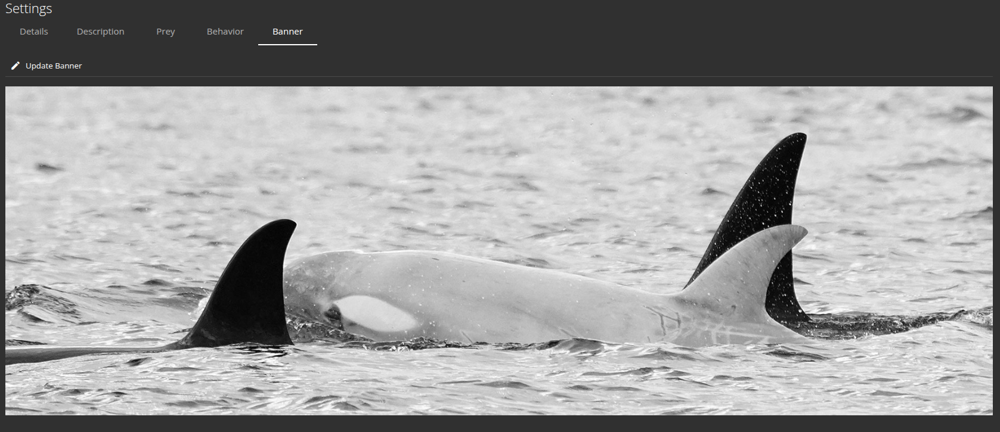

.. _settings:
Settings
============

===================
Population Settings
===================

These settings are designed to help population administrators with keeping things organized.

From this page, the users can see a list of which populations they are members. Administrators of these populations have a few more options available to them.

-----------------------
Individuals
-----------------------

From this page, the population administrator can quickly view the salient details of each animal in their
population. This module offers the ability to create, edit, filter, and delete individuals.

Individual Creation
-----------------------

The user must simply specify an identifier, along with any other known attributes, and the individual will be added to the list

Individual Update
-----------------------

The user can also update attributes at any time.

Individual Alternative IDs
---------------------------
Because we are aware of the fact that differing organizations have differing naming methods, the ability exists
for administrators to add alternative IDs to each individual. These will be displayed on the main page as

<main ID> / <alternate ID 1> / <alternate ID 2> ....

.. _main_settings:

-----------------------
Main Settings
-----------------------
From this page the administrator can update things such as

- The display name
- The species name
- The population abbreviation

- The name of the location where the population is centered

As well as things like the submission settings. Here the admin can specify:

- If a user has to request to join the population
- If the photos submitted to the population should be :ref:`Auto-tagged <auto_tag>`

-----------------------
Description
-----------------------
This module allows the administrator to specify a blurb which will accompany the population statistics on the dedicated
'about' page for the population.

-----------------------
Prey
-----------------------

-----------------------
Behavior
-----------------------

-----------------------
Banner
-----------------------

